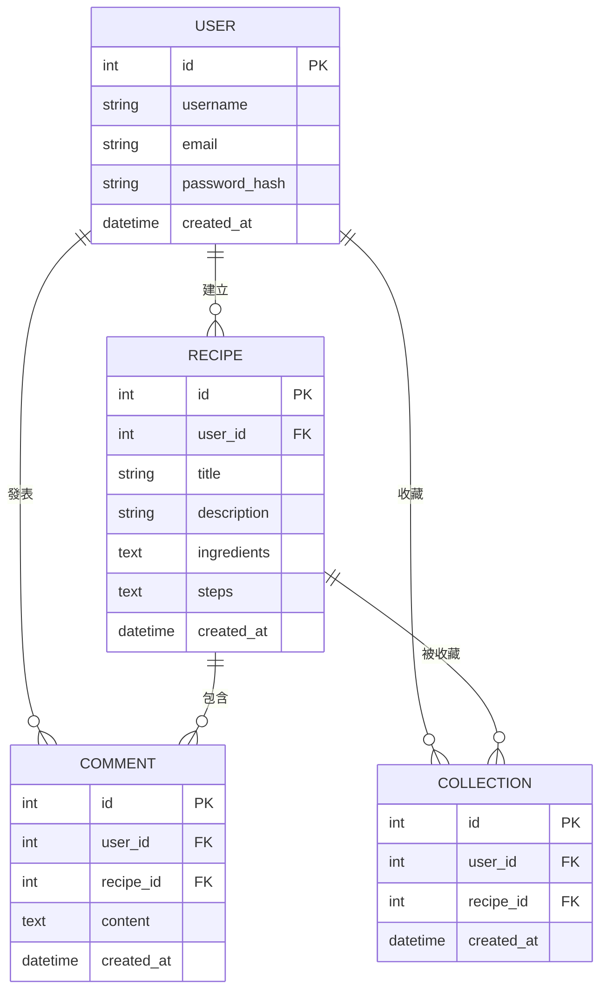

# 資料庫設計文件 (DB Design) - 食譜收藏檢索系統

本文件根據產品需求 (PRD) 與系統架構 (ARCHITECTURE) 設計 SQLite 資料庫 Schema，包含實體關係圖 (ER 圖) 與各資料表的詳細說明。

## 1. ER 圖 (實體關係圖)

## 2. 資料表詳細說明

### 2.1 User (使用者表)
儲存會員的基本資料與認證資訊。
- `id` (INTEGER): Primary Key，自動遞增。
- `username` (VARCHAR(50)): 使用者名稱，必填，唯一。
- `email` (VARCHAR(120)): 電子信箱，必填，唯一。
- `password_hash` (VARCHAR(128)): 加密後的密碼，必填。
- `created_at` (DATETIME): 帳號建立時間，預設為當前時間。

### 2.2 Recipe (食譜表)
儲存使用者分享的食譜資訊。為求 MVP 開發速度，食材與步驟先以 TEXT 格式儲存。
- `id` (INTEGER): Primary Key，自動遞增。
- `user_id` (INTEGER): Foreign Key，關聯至 `User.id`，必填。代表食譜作者。
- `title` (VARCHAR(100)): 食譜名稱，必填。
- `description` (TEXT): 食譜簡介，選填。
- `ingredients` (TEXT): 食材清單（逗號分隔或純文字），必填。用於「食材檢索」。
- `steps` (TEXT): 烹飪步驟，必填。
- `created_at` (DATETIME): 發布時間，預設為當前時間。

### 2.3 Comment (留言表)
儲存使用者在特定食譜下的留言與互動。
- `id` (INTEGER): Primary Key，自動遞增。
- `user_id` (INTEGER): Foreign Key，關聯至 `User.id`，必填。代表留言者。
- `recipe_id` (INTEGER): Foreign Key，關聯至 `Recipe.id`，必填。代表被留言的食譜。
- `content` (TEXT): 留言內容，必填。
- `created_at` (DATETIME): 留言時間，預設為當前時間。

### 2.4 Collection (收藏表)
儲存使用者與食譜之間的多對多「收藏」關係。
- `id` (INTEGER): Primary Key，自動遞增。
- `user_id` (INTEGER): Foreign Key，關聯至 `User.id`，必填。
- `recipe_id` (INTEGER): Foreign Key，關聯至 `Recipe.id`，必填。
- `created_at` (DATETIME): 收藏時間，預設為當前時間。
