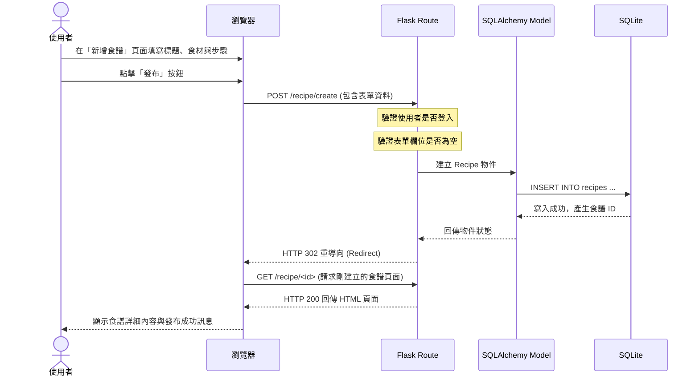

# 流程圖文件 (Flowchart) - 食譜收藏檢索系統

本文件視覺化了使用者的操作路徑與系統內的資料流動，並列出所有功能的網址路由設計，協助後續開發與測試。

## 1. 使用者流程圖 (User Flow)

此圖展示了使用者從進入首頁後，可能進行的各種操作路徑，包含搜尋食譜、瀏覽詳細內容，以及登入後的專屬功能（上傳食譜、收藏、留言等）。

```mermaid
flowchart LR
    Start([使用者進入網站]) --> Home[首頁]
    
    %% 搜尋流程
    Home --> Search{依據什麼搜尋？}
    Search -->|食材| Result[搜尋結果列表]
    Search -->|菜名| Result
    Result --> Detail[食譜詳細頁面]
    
    %% 登入與未登入操作
    Detail --> LoginCheck{是否登入？}
    LoginCheck -->|否| AuthPrompt([提示：請先登入])
    AuthPrompt --> Login[登入 / 註冊頁面]
    LoginCheck -->|是| Interact{互動操作}
    Interact -->|點擊收藏| Collect[加入/移除 我的收藏]
    Interact -->|送出留言| Comment[新增留言]
    
    %% 會員專屬功能
    Home --> Login
    Login --> Profile[個人頁面\n(我的食譜、我的收藏)]
    
    Profile --> CreateRecipe[新增食譜]
    Profile --> EditRecipe[編輯自己上傳的食譜]
    Profile --> DeleteRecipe[刪除自己上傳的食譜]
```

## 2. 系統序列圖 (Sequence Diagram)

以下以「使用者登入後，新增一篇食譜」為例，展示從前端表單送出到後端寫入資料庫的完整序列圖。



## 3. 功能清單對照表

本表列出系統主要功能對應的 URL 路徑與 HTTP 方法，作為後續開發 `routes` 的依據。

| 模組 | 功能名稱 | HTTP 方法 | URL 路徑 | 說明 |
| :--- | :--- | :--- | :--- | :--- |
| **首頁** | 網站首頁 | GET | `/` | 顯示搜尋列、熱門/最新食譜 |
| **會員** | 註冊 | GET / POST | `/auth/register` | 顯示註冊表單 / 送出註冊資料 |
| **會員** | 登入 | GET / POST | `/auth/login` | 顯示登入表單 / 送出登入資料 |
| **會員** | 登出 | GET | `/auth/logout` | 清除登入狀態 |
| **會員** | 個人頁面 | GET | `/user/profile` | 顯示使用者上傳的食譜與收藏清單 |
| **食譜** | 搜尋結果 | GET | `/recipe/search` | 處理食材或菜名的搜尋請求 |
| **食譜** | 食譜詳細內容 | GET | `/recipe/<id>` | 顯示特定 ID 的食譜與其留言 |
| **食譜** | 新增食譜 | GET / POST | `/recipe/create` | 顯示新增表單 / 送出食譜資料 (需登入) |
| **食譜** | 編輯食譜 | GET / POST | `/recipe/<id>/edit` | 顯示編輯表單 / 送出更新資料 (限原作者) |
| **食譜** | 刪除食譜 | POST | `/recipe/<id>/delete` | 刪除特定食譜 (限原作者) |
| **食譜** | 收藏 / 取消收藏 | POST | `/recipe/<id>/collect`| 切換收藏狀態 (需登入) |
| **互動** | 新增留言 | POST | `/recipe/<id>/comment`| 在特定食譜下方留言 (需登入) |
